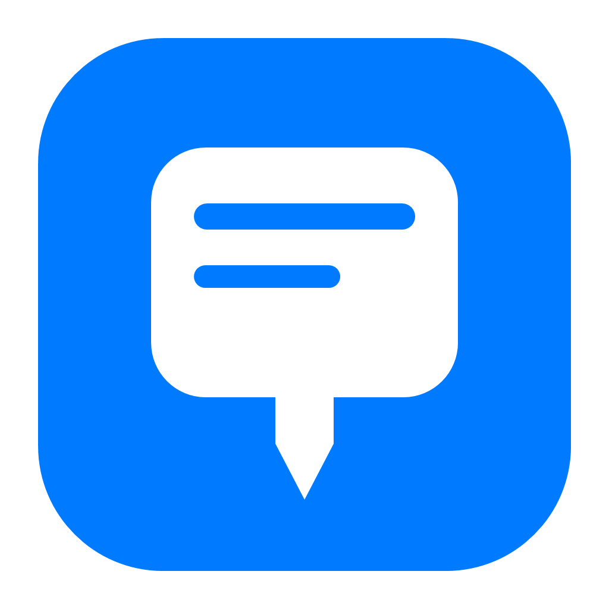
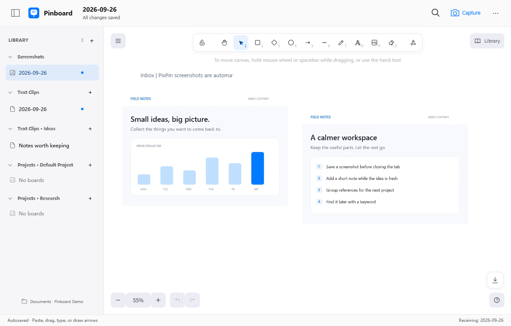
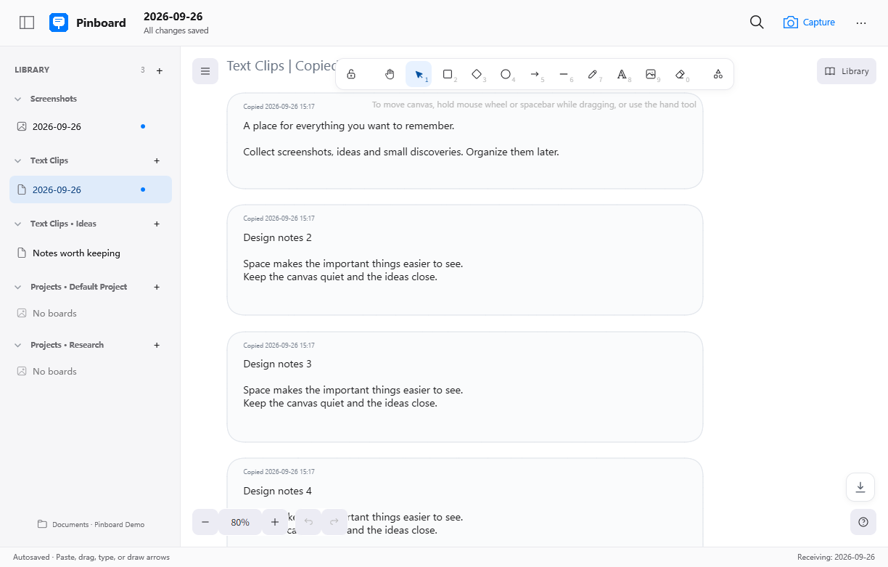
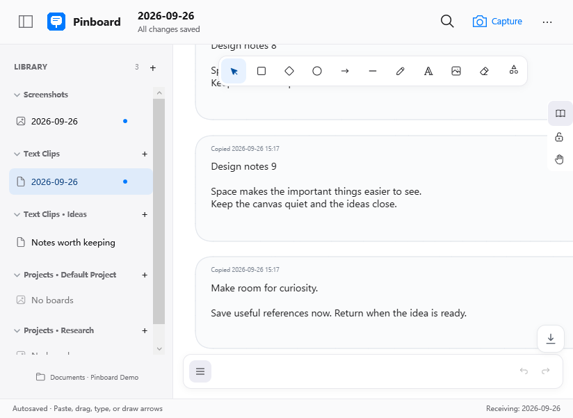

<p align="center">
  
</p>

# Pinboard

**Capture now. Organize later.**

A local-first Windows workspace for screenshots, copied text, and the ideas you want to find again. Capture with PixPin, collect quietly in the background, then arrange everything on an infinite canvas.

**English** · [简体中文](README.zh-CN.md)

[Download for Windows](https://github.com/franklai-rise/Pinboard/releases/latest) · [What's new in 0.7.3](docs/releases/v0.7.3.md) · [MIT License](LICENSE)



## A quieter place for useful things

- **Screenshots, without the extra paste.** While Pinboard is running, use PixPin's normal `Ctrl+Alt+A`, then finish by copying. The capture goes to today's board or a fixed destination.
- **Text clips, when you choose.** Opt in to collect copied plain text as separate, timestamped cards. Choose daily, monthly, legacy single-board, or fixed-target collection.
- **An infinite canvas.** Move and resize images; add text, arrows, shapes, and freehand notes using Excalidraw.
- **A library that stays organized.** Separate screenshot and text sections, custom projects, text folders, collapsed history, and display names independent of filenames.
- **Find it again.** Search notes and locally recognized Chinese/English image text across the library, then jump to the result.
- **One portable file per board.** Images, scene data, and indexes live together in a SQLite `.pinboard` file. Import Excalidraw or Obsidian Excalidraw; export PNG, SVG, or `.excalidraw`.

## See it in action

### Text clips with room to breathe

Each copy becomes a separate card, including repeated copies. Use the bottom-right button to jump to the end without changing zoom.



### A compact, focused interface

One top toolbar, contextual row actions, a collapsible sidebar, and a clean blue-and-white visual language. English and Chinese are available from **More ···**.



These are captures of the running app with synthetic demonstration content. The demo library label replaces a machine-specific folder path; no personal clipboard history is shown. [Reproduce the screenshots](docs/screenshots.md).

## Get started

1. Download `Pinboard-windows-x64.zip` from [Releases](https://github.com/franklai-rise/Pinboard/releases/latest), extract it, and run `Pinboard.exe`.
2. Keep PixPin running. Press `Ctrl+Alt+A`, select an area, then press your configured copy action, such as `Enter` or `Ctrl+C`. Cancelled captures create no empty cards.
3. Open Pinboard later to arrange the captured images, add notes, or search.
4. For text collection, explicitly enable it in **More → Settings**. Choose **Daily** if you want a fresh text board each day.
5. Use the sidebar **+** to create projects, boards, or text folders. Right-click a board to choose a fixed receiving destination or restore daily collection.

Closing the window hides Pinboard to the tray; receiving continues. To stop all collection, choose **Exit** from its tray menu. Sign-in background startup can be disabled in Settings.

**Requirements:** Windows x64 (Windows 10 build 19041 or later), Microsoft Edge WebView2 Runtime, and PixPin for the screenshot shortcut workflow. The portable build includes .NET. OCR depends on installed Windows recognition languages. Builds are currently unsigned, so Windows may show a trust warning.

## Lighter in the background

Version 0.7.3 starts the background receiver without loading the browser canvas. After the window has been hidden or minimized for about 15 seconds, it confirms saves and releases the canvas and decoded images. Reopening reloads the board and restores the reading position.

On one development machine, the full process group's tray working set went from **646.9 MB** in the previous version to **168.9 MB** after opening a board and hiding the new version (about **74% lower**). This is a single-machine sample, not a general memory guarantee; large boards and OCR still need additional memory.

## Storage and privacy

The default library is `%USERPROFILE%\Documents\Pinboard`; it can be changed in Settings.

| Content | Location within the library |
| --- | --- |
| Daily screenshots | `Screenshots\YYYY-MM-DD.pinboard` |
| Daily text, when selected | `Text Clips\YYYY-MM-DD.pinboard` |
| Monthly text | `Text Clips\YYYY-MM.pinboard` |
| Projects | `Project name\Board name.pinboard` |

Settings and recovery data stay under `%LocalAppData%\Pinboard`.

- No account, telemetry, cloud upload, or online OCR. The canvas blocks external network requests.
- **Text collection is off on new installations.** Existing explicit settings are preserved.
- Optional sensitive-data filtering is best-effort, not a guarantee. Clipboard history may contain passwords or private messages; pause collection before handling sensitive material.
- Board files are **not encrypted by Pinboard**. Use appropriate Windows account and disk protection.
- Images are encoded once as WebP (quality 80 by default), with PNG fallback; saves do not repeatedly recompress them.
- Back up a board with **Save a copy**, or copy the file when it is not being edited. Recovery data does not replace regular backups.

## Build and verify

Use the .NET SDK version targeted by the project, Node.js, and WebView2 on Windows:

```powershell
.\scripts\build-release.ps1
```

The script runs privacy checks, frontend tests, dependency audits, .NET tests, and the Windows x64 self-contained build. The portable package is staged in `artifacts\portable`.

0.7.3 was checked with 54 .NET tests, 14 frontend tests, and 14 isolated desktop smoke checks. A large 200 MB board benchmark and a full multi-monitor/high-DPI matrix remain outside this verification.

[Chinese usage guide](docs/使用说明.md) · [Keyboard shortcuts](docs/快捷键.md) · [Verification notes](docs/验收记录.md)

[Contributing](CONTRIBUTING.md) · [Security](SECURITY.md) · [Third-party licenses](THIRD-PARTY-NOTICES.txt)

Built with WPF, WebView2, React, TypeScript, Excalidraw, SQLite, SkiaSharp, and Windows OCR. Pinboard is MIT-licensed and is not affiliated with PixPin, Obsidian, or Apple.
